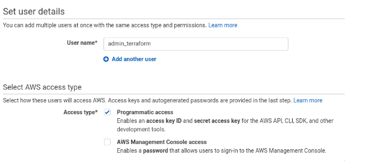
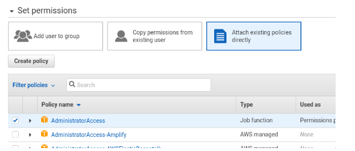
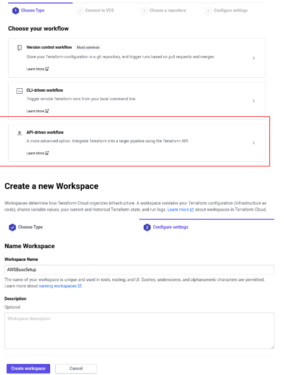
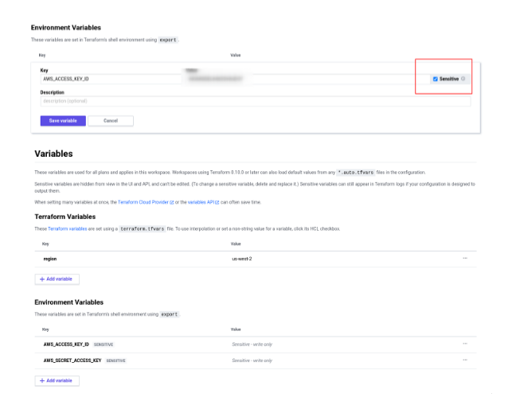
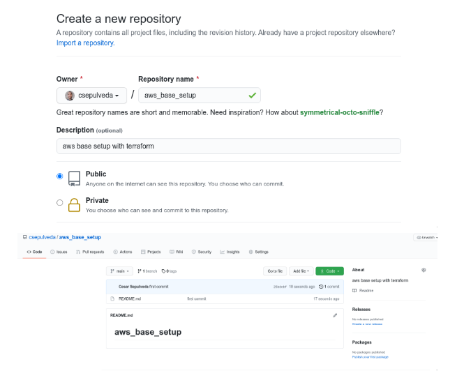
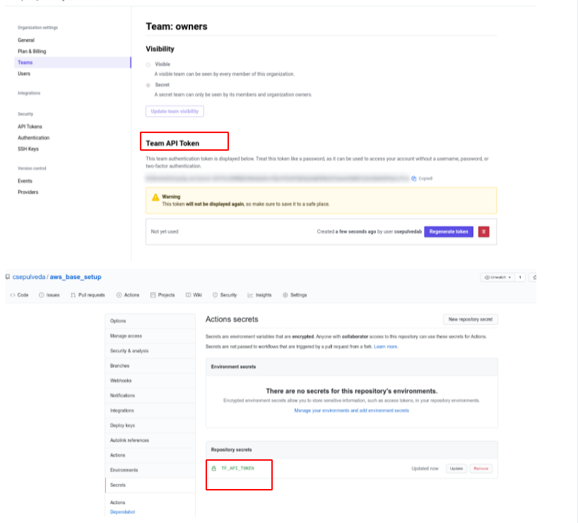
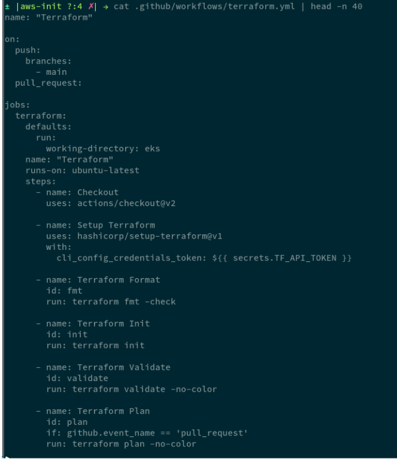
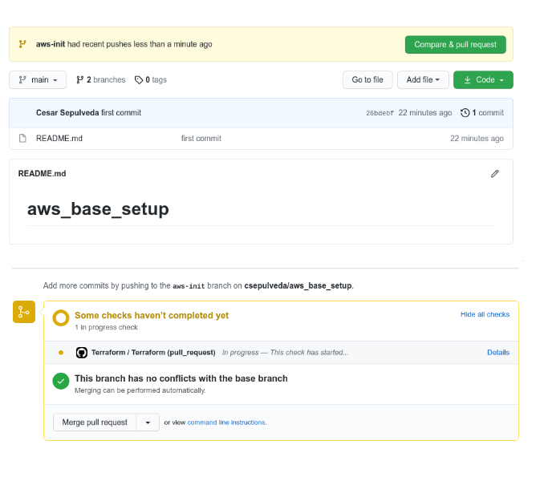
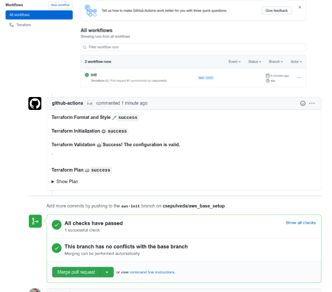

Title: Initial Setup of Terraform and Github Actions
Date: 2021-06-22 08:00
Modified: 2021-06-22 15:18
Category: Terraform
Tags: terraform, aws, github
Slug: Initial-Setup-of-Terraform-and-Github-Actions
Authors: Cesar Sepulveda
Summary: Setup Terraform cloud and Github Acctions to deploy resources on AWS

Terraform is an open-source infrastructure as code software tool that enables you to safely and predictably create, change, and improve infrastructure

Here I will go to describe how to setup an integration between Terraform Cloud and Github Acctions to deploy resources on AWS.
In that way we could have Continuous Delivery and Continuous Delivery (CI/CD) in our Infraestrcuture as a Code (IaC)
Some Stuff that we are going to need to realize this setup:

* Have an AWS account with access to create iam users and grant it full admin privileges.
* Have an Terraform Cloud account.
* Have a Github account.

# Base Setup:
First, we have to create a IAM user and grant him Administrator Access.




In a new browser tab, create a new organization in Terraform cloud, then its neccesary to create a workspace using the `API-diven workflow`



Then we have to create the Environment variables to access the AWS resources, this values must be added as a `sensitve` values.
Also we are goint to create the Terraform variable "region" to specify wich region of AWS are we going to use by default.



Now we are going to create a new github repository and upload the initial files to get ready our setup



Now we must back to terraform to create a `Team API Token` and set up this in our Github Repo as a Secret, this will allow to Github Actions use our Terraform Workspace



Now we are going to create a new banch and upload the basec files to this new branch.
When the open a new Pull Request, github action will run, and when a merge being done againt main branch Github Actions will execute the terraform Apply.



The full code could be checked here:
https://github.com/csepulveda/aws_base_setup/pull/1/files

The repo structure is the following:

```
.github/
└── workflows
    └── terraform.yml  #This cointains the github actions code.
.
├── main.tf            #terraform backend remote configuration
├── providers.tf       #instance the aws provider
├── README.md          #sample readme file
└── variables.tf       #default variables
```

Now when the files are uploaded, and we create a new PR, we could see the github actions working.



if everything goes fine, we could the this final status in our github actions:



Now is possible start to create resources using this repository and there is no need make any terraform action from our local computers or be worried about where store out terraform states.

